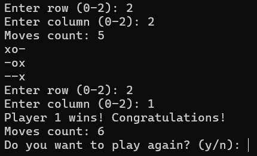

# Tic-Tac-Toe in C

This is a Tic-Tac-Toe game implemented in C. The game features a 3x3 board where two players (Player 1 and Player 2) take turns marking spots with "X" or "O". The game automatically checks for a winner after each move and displays the result (winner or tie). After the game ends, players are given the option to play again.

## Screenshots



## Features
- 3x3 Tic-Tac-Toe board
- Player 1 uses "X" and Player 2 uses "O"
- Game checks for winners after each move
- Option to play again after the game ends

## How to Run

1. Clone the repository to your local machine:
   ```bash
   git clone https://github.com/MalkiApplebaum/Tic-Tac-Toe-in-C.git
